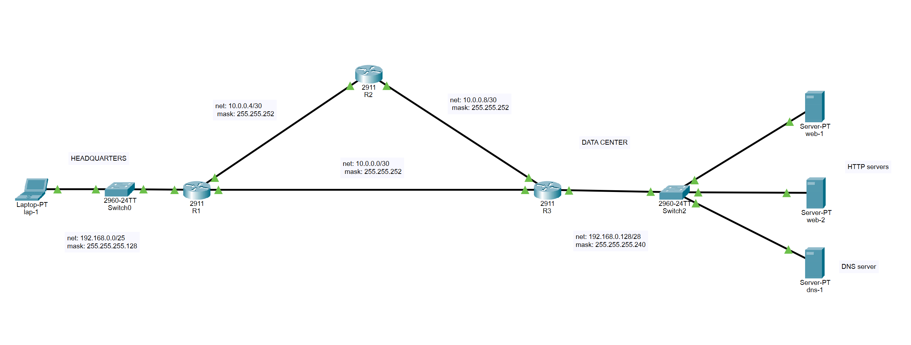

# Network-Architecture-HQ-DC

Scalable enterprise network design connecting Headquarters and a Data Center. Features a redundant routing core, custom VLSM subnetting strategy, and service deployment (DNS/HTTP) within a secure, segmented environment.

## Project Overview
This project simulates a corporate network infrastructure designed for high availability and efficient resource management. It bridges a **Headquarters (HQ)** site with a **Data Center (DC)** using a redundant triangular router topology, ensuring no single point of failure in the WAN backbone.

## Key Architectural Features
- **Redundant Core:** R1, R2, and R3 routers form a mesh/triangle to provide alternative paths for traffic, critical for business continuity.
- **VLSM Subnetting Strategy:** Optimized IP address allocation to minimize waste across different segments:
  - **HQ Segment:** `192.168.0.0/25` (Supporting up to 126 hosts).
  - **WAN Links:** Multiple `/30` subnets for point-to-point router connectivity.
  - **Data Center Segment:** `192.168.0.128/28` (Secure, high-density server zone).
- **Service Infrastructure:** - Dual HTTP Servers for load balancing/redundancy testing.
  - Dedicated DNS Server for internal domain name resolution.

## Subnetting Table (VLSM)
| Segment | Network Address | Subnet Mask | Usable IP Range |
| :--- | :--- | :--- | :--- |
| **Headquarters** | $192.168.0.0$ | $255.255.255.128$ | $.1$ to $.126$ |
| **Data Center** | $192.168.0.128$ | $255.255.255.240$ | $.129$ to $.142$ |
| **WAN Link R1-R3** | $10.0.0.0$ | $255.255.255.252$ | $.1$ to $.2$ |

## Technical Implementation
- **Hardware Simulated:** Cisco 2911 Routers, 2960-24TT Switches.
- **Routing Protocols:** [Indica si usaste OSPF, EIGRP o Estático].
- **Network Services:** Integrated Web and DNS services for end-to-end connectivity verification.
